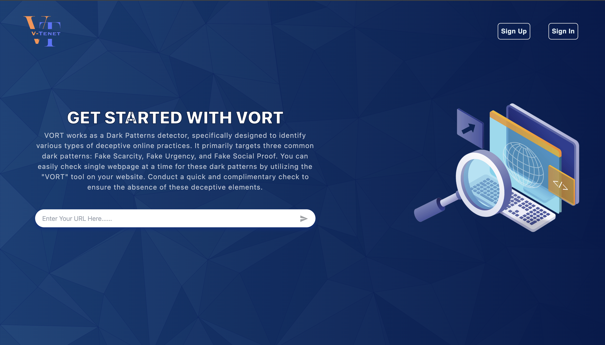
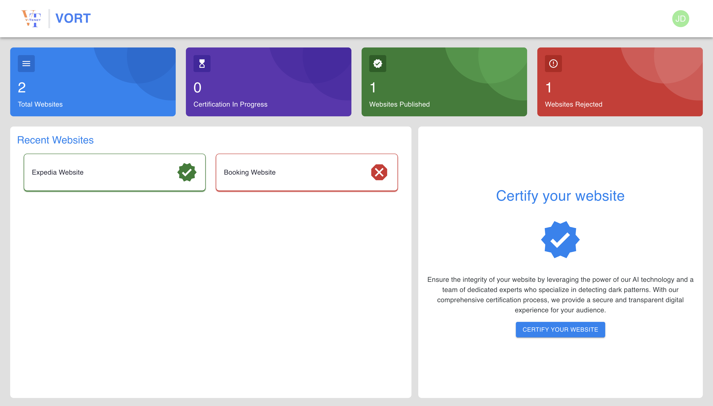
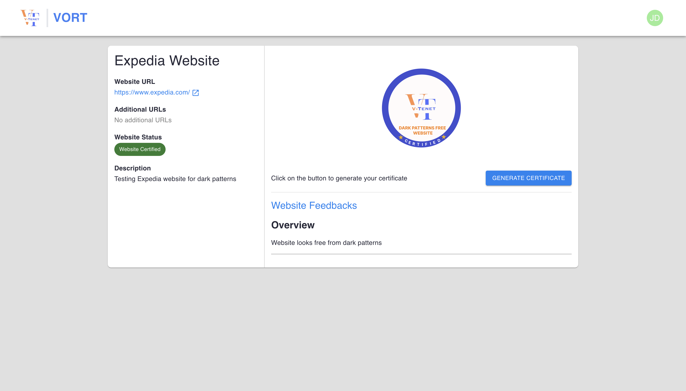

# V-Tenet Dark Pattern Detection Project
Welcome to [VORT](http://vtenet.s3-website.eu-central-1.amazonaws.com/) presented by [V-Tenet](https://v-tenet.vercel.app/) team. 
VORT is dedicated to certifying websites that uphold transparency and are free from dark patterns.
This is a Web Engineering Research Project created by V-Tenet team
for the **Planspiel** at [Technische Universität Chemnitz](https://www.tu-chemnitz.de/index.html).




## Introduction

The V-Tenet Dark Pattern Detection Product (**VORT**) is designed to analyze websites for the presence of dark patterns and certify them if they are deemed free of such manipulative practices.

You can check out the code for the project using [this link](https://gitlab.hrz.tu-chemnitz.de/vsr/edu/planspiel/WS2324/v-tenet).

This project consist of three modules:

- Frontend `frontend`
- Backend `backend-api`
- ML Service `ml-model-service`

Each component is containerized using [Docker](https://www.docker.com/) to ensure easy deployment and scalability.

### [Backend](https://gitlab.hrz.tu-chemnitz.de/vsr/edu/planspiel/WS2324/v-tenet/-/tree/main/backend-api)

The backend serves as the central hub of the application. It handles the business logic, manages communication between the **Frontend** and **ML Service**, and stores relevant data in a [MongoDB](https://www.mongodb.com/) database. The backend orchestrates the entire workflow, ensuring seamless integration between the user interface and the dark pattern detection process.


### [ML Service](https://gitlab.hrz.tu-chemnitz.de/vsr/edu/planspiel/WS2324/v-tenet/-/tree/main/ml-model-service)

The ML Service is the core of the dark pattern detection process. It employs web scraping techniques to analyze the provided websites for any signs of dark patterns. Machine learning models are utilized to identify patterns and make informed decisions. The ML Service communicates with the backend to send analysis results.

### [Frontend](https://gitlab.hrz.tu-chemnitz.de/vsr/edu/planspiel/WS2324/v-tenet/-/tree/main/frontend)

The frontend section is responsible for the user interface of the application. Users interact with this component to input the websites they want to analyze for dark patterns. The frontend communicates with the backend to submit requests and receive certification results. It is developed with UI logic to enhance user experience.


## Getting Started

Follow these steps to set up the V-Tenet Dark Pattern Detection Application on your system:

### Prerequisites

Before you begin, make sure you have the following installed on your system:

- Node.js (Version: 18)
- npm (Version: 9)
- Python (Version: 3)
- Docker (Version: 24)
- Docker Compose (Version: 2)
- MongoDB

## Installation

Clone the repository to your local machine
   ```bash
   $ git clone https://gitlab.hrz.tu-chemnitz.de/vsr/edu/planspiel/WS2324/v-tenet.git
   
   # navigate to root project directory
   $ cd v-tenet
   ```
You can run each module separately. For that check the instructions for [Backend](https://gitlab.hrz.tu-chemnitz.de/vsr/edu/planspiel/WS2324/v-tenet/-/tree/main/backend-api),
[ML Service](https://gitlab.hrz.tu-chemnitz.de/vsr/edu/planspiel/WS2324/v-tenet/-/tree/main/ml-model-service), [Frontend](https://gitlab.hrz.tu-chemnitz.de/vsr/edu/planspiel/WS2324/v-tenet/-/tree/main/frontend).

Also, you can run the entire project using Docker. For that you need to have [Docker](https://www.docker.com/get-started/)  and [Docker Compose](https://docs.docker.com/compose/) installed in your local machine.

```bash
# command to check docker version
$ docker --version

# command to check docker compose version
$ docker-compose --version
```

**Note:** Before executing below docker commands make sure docker is running in your local machine.

### Instructions to start docker container
1. Create `.env` file inside `frontend` directory and set following properties
   ```bash
   REACT_APP_API_BASE_URL_CLIENT='http://localhost:8080'
   REACT_APP_ML_MODEL_BASE_URL='http://localhost:5001'
   ```
2. Create `.env.docker` inside `backend-api` directory and set following properties
   ```bash
   APP_PORT=8080
   MONGO_URI='mongodb://mongo:27017/dark-pattern'
   JWT_SECRET='docker-dark-pattern-token'
   ```

3. Build the Docker containers for each section
   ```bash
   docker-compose build
   ```
4. Start the Docker containers
   ```bash
   docker-compose up
   ```
5. To stop the application, run the command
   ```bash
   docker-compose down
   ```
6. Build and run docker containers with a **single command**:
   ```bash
   docker-compose up --build
   ```
7. Check all the running docker containers using the command:
   ```bash
   docker ps
   ```
   Here you will see 4 containers running for frontend module, backend-api module, ml-model-service module and mongodb.


8. To check the data stored in the MongoDB, install [MongoDB Compass](https://www.mongodb.com/products/tools/compass). Enter `mongodb://localhost:27018/` as a connections string URL in MongoDB Compass to view the data stored in db.


9. Swagger UI can be accessed at [http://localhost:8088/api-docs](http://localhost:8088/api-docs).


**The application will be accessible at [http://localhost:3000](http://localhost:3000)**

## Client Dashboard


## Website Certification


## Contributors

Ajay Dhami: [Github](https://github.com/AjayDhami) | [Linkedin](https://www.linkedin.com/in/ajay-dhami/) <br/>
Amay Rajvaidya: [Github](https://github.com/AMAY27) | [Linkedin](https://www.linkedin.com/in/amay-rajvaidya-886291188/) <br/>
Drashti Patel: [Github](https://github.com/pdrashti8) | [Linkedin](https://www.linkedin.com/in/drashtipatel89) <br/>
Kashfa Sehejat Sezuti: [Github](https://github.com/kashfasehejatsezuti) | [Linkedin](https://www.linkedin.com/in/kashfa-sehejat-sezuti/) <br/>
Prabudh Mishra: [Github](https://github.com/prabudh-mishra) | [Linkedin](https://www.linkedin.com/in/prabudhmishra)

## Stay in Touch

Feel free to reach out to the developers for any questions or feedback. Here are some ways to stay in touch:

- Website: [V-Tenet](https://v-tenet.vercel.app/)
- LinkedIn: [LinkedIn](https://www.linkedin.com/in/v-tenet/)
